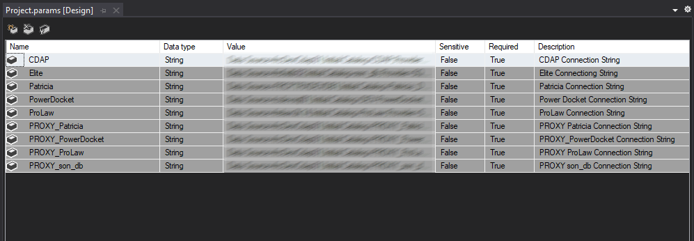
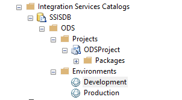
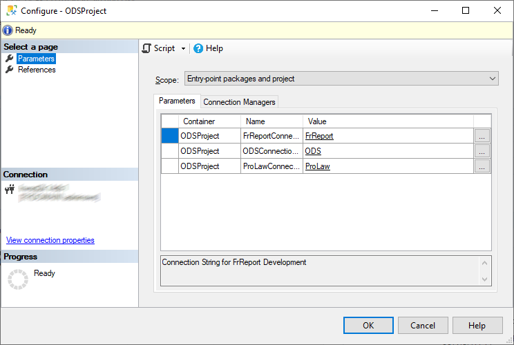

# SSIS Knowledge Share

### Resources
[SSIS Parameters and Environments (YouTube)](https://www.youtube.com/watch?v=3HcPJCBS_KY)  
[Deploy Integration Services (SSIS) Projects and Packages](https://learn.microsoft.com/en-us/sql/integration-services/packages/deploy-integration-services-ssis-projects-and-packages?view=sql-server-ver16)  
 
### Requirements
Visual Studio Community Edition 2019 (Or higher)  
SQL Server Integration Services Project Extension - [Visual Studio Marketplace](https://marketplace.visualstudio.com/items?itemName=SSIS.SqlServerIntegrationServicesProjects)  
 
### Notes
1. We'll want to use Project Deployment Model going forward with any new SSIS projects as well as transition any deployed currently as Package Deployment Model as time and resources permit.
2. Project Deployment Model facilitates the use of Environment specific parameters, in particular connection strings
3. Project Deployment Model enables detailed logging that aids in troubleshooting

### Project Parameters
You'll want to add a Project scoped parameter for each connection string relevant to your project. The Value in this case should be considered development-time connections. By making the parameter required, we will (later) be required to supply a new value (such as a production value). The parameter need not be sensitive since we would use integrated authentication.  
  
  
 
### Project Connection Managers  

Generally all connection managers should be Project scoped. This aids in visibility and minimizes confusion.  

 
Within any package you will see at the bottom the Connection Managers tab (below). Project scoped connections are noted in parentheses. Viewing the properties of a connection manager gains you access to the Expressions property. From there you can select the appropriate parameter for the connection.  
  
  
  
   
Defining parameters and associating them with expressions will ensure these parameters can be accessed and used by the deployed Project on SQL Server.  
 
### SQL Server & Integration Services Catalog  
 
When you deploy an SSIS solution project to SQL Server, you will find the project under Integration Service Catalogs. You will want to create an Environment property for each environment scope you will use. Later, the SQL Server Job will use one of the environments you set it up to run under.  
 
Each environment will list the same parameters, in this case connection strings, as you created in the SSIS package. Use the appropriate connection strings for each environment: development, production.  
  
  
 
Configure and define project Parameters and References, similar as to the example below. The parameters and expressions you set up in the SSIS project in Visual Studio should reflect what you see here.
   
 
### SQL Server Job Configuration  
When you create and define the SQL Server Job, you add a step and configure that step to run a package using a particular environment.  
 
1. You need to run the step as (Run as) the domain account assigned for the project
2. In the Package tab (below) select the DTS package file to run from the appropriate location
3. Select the appropriate environment for the job, these are the environments you created earlier  

  

